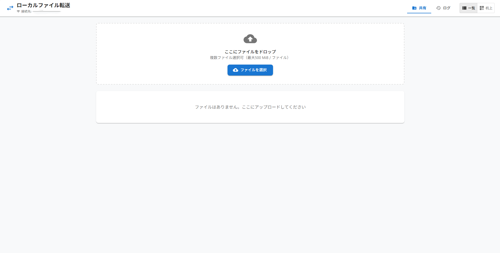
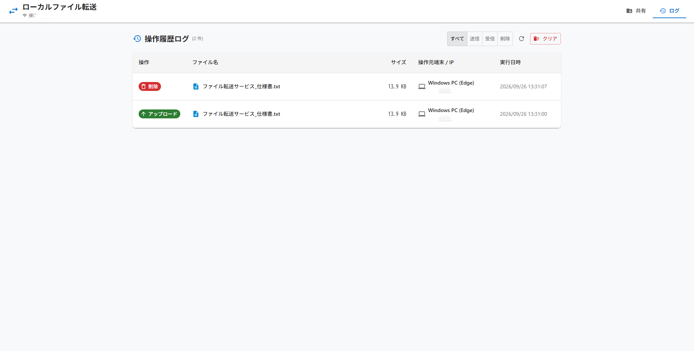

# CloudDrop
旧名：ローカルファイル転送サービス (Local File Transfer Service)

同一LAN内のPC（Windows, Mac）やスマートフォン（iPhone Safari等）からブラウザで安全かつ軽快にファイルを送受信できる完全ローカルなWebファイル転送サービスです。




## 特徴

- **完全ローカル**: クラウドを介さず、自宅やオフィスの同一LAN内でのみファイルを受け渡し。
- **マルチデバイス対応**: Windows, Mac, iPhone（写真ライブラリ・ファイル選択対応）などブラウザさえあれば利用可能。
- **2つの表示モード**:
  - **一覧表示**: 5項目（アイコン、ファイル名、アップロード日時、削除予定日時、サイズ）表示。長押し（500ms）・右クリック・「その他」メニューからの操作に対応。
  - **机上表示**: 淡いデスク背景に散らばった紙風カード。ファイルIDから決定論的に配置され、リロードしても位置が飛ばない安定した表示。
- **画像プレビュー**: JPEG, PNG, GIF, WebP のマジックバイト検査による安全なインラインプレビュー（SVG・HTMLは除外）。
- **自動クリーンアップ**: アップロード完了から1時間（3600秒）で自動削除。サーバー起動時および1分周期の走査に加え、APIアクセス時のリアルタイム期限切れ判定。
- **安全なダウンロード**: RFC 5987 / RFC 6266 に準拠したファイル名エンコード（日本語・記号対応）、`X-Content-Type-Options: nosniff`。
- **同時アップロード制御**: 最大2並列のキュー管理、プログレス表示、失敗時リトライ。

## 技術スタック

- **フロントエンド**: React 19, TypeScript, Material UI (MUI v6), Vite
- **バックエンド**: Node.js (v22+), TypeScript, Fastify, `@fastify/multipart`, `@fastify/static`
- **データベース / ストレージ**: SQLite (`node:sqlite`), ローカルディスク (`data/files/`)

## 起動方法

### 1. 依存関係のインストール & ビルド
```bash
# パッケージのインストール
npm install

# フロントエンドとバックエンドのビルド
npm run build
```

### 2. サービスの起動
```bash
npm run start
```

起動すると、ターミナルに以下のような接続情報が表示されます：
```text
====================================================
 サーバーが正常に起動しました！
 ローカル利用:     http://localhost:3000
 同一LAN内の端末:  http://192.168.x.x:3000
 保存期間:         60 分
 1ファイル上限:    500 MiB
 全体保存上限:     5 GiB
====================================================
```

### 3. 他の端末（iPhone, Mac等）からの接続
同一Wi-Fi（LAN）に接続したiPhoneのSafariやMacのブラウザから、ターミナルに表示された `http://192.168.x.x:3000` にアクセスしてください。

## 開発モード

```bash
# サーバー（ポート3000）
npm run dev:server

# フロントエンド（ポート5173、APIプロキシ経由）
npm run dev:client
```

## テストの実行

```bash
# バックエンド単体＆結合テスト（MIME判定、アップロード、DL、期限切れ、クリーンアップ）
npm --workspace=server run test
```

### 4. HTTPS化

1. プライベート認証局(CA)の秘密鍵と証明書を作成
```bash
openssl req -x509 -new -nodes -keyout /etc/nginx/ssl/ca.key -sha256 -days 365 -out /etc/nginx/ssl/ca.crt -subj "/CN=FileTransferCA"
```

2. サーバー用の秘密鍵を作成
```bash
openssl genrsa -out /etc/nginx/ssl/privkey.pem 2048
```

3. サーバー用の署名要求(CSR)を作成
```bash
openssl req -new -key /etc/nginx/ssl/privkey.pem -out /etc/nginx/ssl/server.csr -subj "/CN=file-transfer.network"
```

4. SAN(代替名)付きでサーバー証明書を発行
```bash
openssl x509 -req -in /etc/nginx/ssl/server.csr \
  -CA /etc/nginx/ssl/ca.crt -CAkey /etc/nginx/ssl/ca.key -CAcreateserial \
  -out /etc/nginx/ssl/crt.pem -days 365 -sha256 \
  -extfile <(echo "subjectAltName=DNS:file-transfer.network,IP:192.168.100.1")
```

5. パーミッション設定
```bash
sudo chmod 644 /etc/nginx/ssl/crt.pem /etc/nginx/ssl/ca.crt
sudo chmod 600 /etc/nginx/ssl/privkey.pem /etc/nginx/ssl/ca.key
```